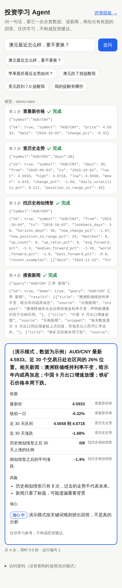
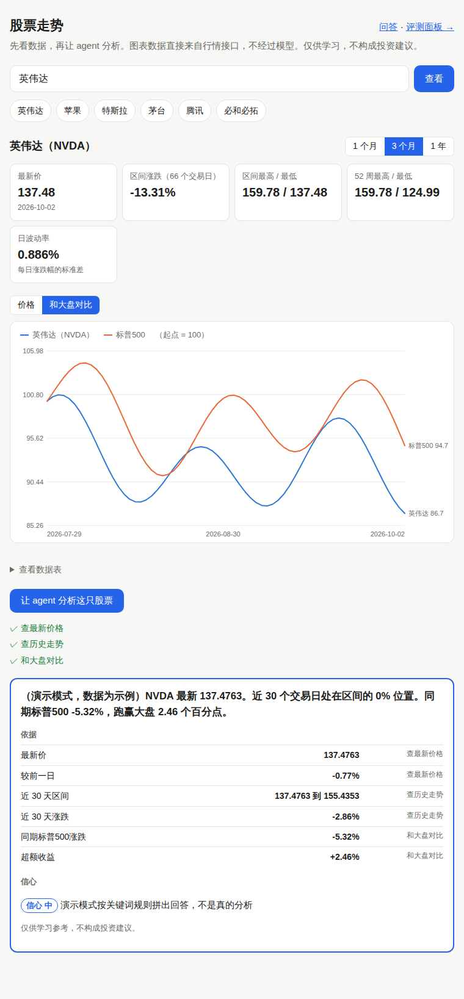

# invest-agent 投资学习 Agent

问一句话，看它一步步查数据、读新闻，再给出有依据的回答。

比如问「澳元最近怎么样，要不要换？」，agent 会自己决定：先查实时汇率，再查近 30 天走势，再搜相关新闻，最后综合回答并写出依据。网页上会实时显示每一步调用了什么工具、拿到了什么数据。

 

> 仅用于学习投资知识，不做真实交易，回答不构成投资建议。
> 它的前身是 [fx-bot](https://github.com/Szt-123-coder/fx-bot)（汇率提醒机器人）。

## 能做什么

| 功能 | 例子 |
| --- | --- |
| 多步分析 | 澳元最近怎么样，要不要换？ / 英伟达和特斯拉最近哪个涨得多？ |
| 股票页面 | `/stock`：走势图（1 个月 / 3 个月 / 1 年）、关键数字、和大盘对比，再一键让 agent 分析 |
| 和大盘对比 | 英伟达最近跑赢大盘了吗？（A 股比沪深300，港股比恒生，韩股比 KOSPI，日股比日经225，其他比标普500） |
| 历史相似情形 | 过去 3 年里和现在走势相似的时候，之后 30 天涨了几次、平均涨跌多少 |
| 查价格和走势 | 美元现在多少人民币？ / 茅台最近走势怎么样？ |
| 读新闻 | 澳元为什么最近涨了？ |
| 模拟投资 | `/portfolio`：你和 AI 各一个账户，起始金额自己定；你自己下单（问答里说「用 3000 买英伟达」也行），AI 每天早上自己决定并写理由，都和沪深300、标普500「买了不动」比（[设计说明](docs/design/007-paper-trading.md)） |
| 每日新闻摘要 | `/digest`：每天定时给关注的标的搜新闻，模型提炼「发生了什么、偏涨还是偏跌」，代码核对后推送到微信（[设计说明](docs/design/006-news-digest.md)） |
| 价位提醒 | 美元跌到 7.0 提醒我 |
| 波动提醒 | 澳元跌了就提醒我（从高点每跌 0.2% 提醒一次） |
| 关注和偏好 | 帮我关注英镑 / 记住，我只关心换汇 |

回答按固定格式给出：**结论、依据、风险、信心、执行结果**。依据里每个数字都注明来自哪个工具，评测会用代码核对这些数字是不是工具真查到的（[设计说明](docs/design/004-structured-output.md)）。

## 架构

```
网页 / 评测脚本 / 定时任务（提醒、每日摘要）
          │
     FastAPI 服务 ── 流式推送每一步，并存进数据库
          │
   Agent（LangChain create_agent，ReAct 循环）◄──► 大模型（默认 DeepSeek，可替换）
          │
  ┌───────┼──────────┬──────────────┐
查行情    搜新闻      提醒与关注      记忆读写
Yahoo    Tavily       └──── SQLite ────┘
```

| 部分 | 选择 | 为什么 |
| --- | --- | --- |
| Agent | LangChain / LangGraph | 主流框架；另有 [手写版循环](app/react_by_hand.py) 对照学习原理 |
| 大模型 | DeepSeek，兼容 OpenAI 接口的都能换 | 工具调用稳定、便宜；换模型只改环境变量 |
| 新闻 | Tavily 搜索 API | 专为 agent 设计 |
| 行情 | Yahoo Finance | 汇率和全球股票都有 |
| 数据库 | SQLite + SQLAlchemy | 一个文件即可；换 PostgreSQL 只改 `DATABASE_URL` |
| 网页 | FastAPI + 原生 HTML，Server-Sent Events | agent 每走一步就推给页面 |

设计取舍写在 [docs/design](docs/design)。

## 评测

`evals/cases.jsonl` 里是测试题，每题写明期望调用的工具和参数、不该调用的工具、回答的评分标准。

```bash
python -m evals.run_eval
```

- **规则评测**：检查 agent 做的事。工具和参数对不对，修改失败时有没有假装成功，依据里的数字能不能在注明的工具结果里找到
- **模型裁判**：另一个模型按评分标准给回答打 1–5 分（有密钥时才跑）
- **人工抽检**：每次评测导出 `evals/reports/<编号>.csv`，人工在 `human_score` 列打分，和裁判对比

结果显示在网页的「评测面板」（`/eval`）。

## 本地运行

```bash
pip install -r requirements-dev.txt
cp .env.example .env      # 不填密钥就是演示模式，不花钱
uvicorn app.main:app --reload
# 打开 http://localhost:8000
```

不配置任何密钥时，项目用「演示模式」运行：一个按关键词规则调用工具的假模型，配合示例行情和示例新闻。页面和步骤都是真的在跑，只是「思考」部分是规则，不是 AI。

测试：`pytest -q`

## 部署

```bash
docker build -t invest-agent .
docker run -d -p 8000:8000 --env-file .env -v invest-data:/app/data invest-agent
```

设了 `ACCESS_PASSWORD` 后，只有在页面里填对密码的人才用真模型，其他访客自动走演示模式，不会产生费用。

## 密钥

所有密钥只放在环境变量或 `.env` 里，`.env` 不会提交到仓库。
